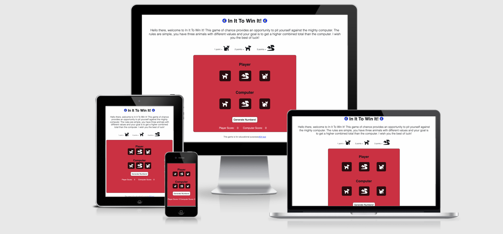

# In It To Win It!
 

In It To Win It! is an online player vs computer game that aims to provide some fun and excitement through the element of chance. The player can generate random animal icons that each have a specific value. The aim of the game is to have a combined higher value than the computer. If so, you're a winner!
 
 

## Features
 

### Main heading

The main heading gives users an insight into this game. The In It To Win It heading flanked by two euro symbols (favicons) suggests to the user that they have the possibility of winning a prize.

### Game Instructions

The game instructions section explains clearly and concisely how to play the game. It states that the game is easy to understand and accessible to all.

### Animal Values

The animal values section informs the user of the value of each animal in the game. This is an expansion of the introduction and rules section and makes sure that the user has all information needed to play and understand the game.

### Main Game Section

This is the main section of the webpage where users will play the game in a player vs computer scenario. This is where they encounter JavaScript through the use of the "Generate Numbers!" button. This is a visually appealing section and the use of symbols instead of numbers lends to the engagement of a younger audience as well as for older audiences. Once the "Generate Numbers!" button is clicked, the numbers function is called in JavaScript to generate the random numbers. These numbers are then calculated and converted back into animals in HTML. Furthermore, an alert tells the user if they have won, drawn, or lost and increments the score at the bottom of this section depending on the result.

### Features Left To Implement

Add an endgame function so that there is a set number of points available before the games ends. e.g. First to reach 10 points wins and ends the game.

## Testing
 

### Technologies

### Validator Testing

### Google Lighthouse Testing

### Responsivity

### Feature Function

### Cross Browser Testing

## Deployment

## Credits

## Acknowledgements