# In It To Win It!
 

In It To Win It! is an online player vs computer game that aims to provide some fun and excitement through the element of chance. The player can generate random animal icons that each have a specific value. The aim of the game is to have a combined higher value than the computer. If so, you're a winner!
 
 
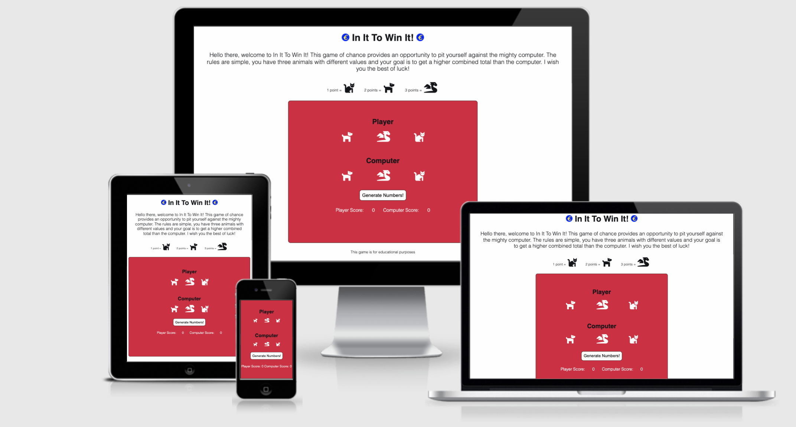

## Features
 

### Favicon

I have used a Favicon logo to display in the title bar. This adds more authenticity to this webpage and it is an easily recognisable logo if you have several tabs open and need to find your way back to this game.

 
 

### Main heading

The main heading which is inside a header to ensure good semantic HTML gives users an insight into this game. The In It To Win It heading flanked by two euro symbols (favicons) suggests to the user that they have the possibility of winning a prize.

 
 

### Game Instructions

The game instructions section explains clearly and concisely how to play the game. It states that the game is easy to understand and accessible to all.

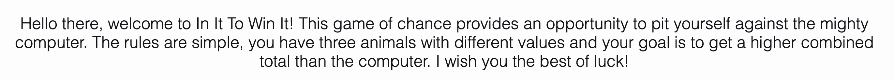
 
 

### Animal Values

The animal values section informs the user of the value of each animal in the game. This is an expansion of the introduction and rules section and makes sure that the user has all information needed to play and understand the game.

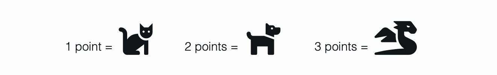
 
 

### Main Game Section

This is the main section of the webpage where users will play the game in a player vs computer scenario. This is where they encounter JavaScript through the use of the "Generate Numbers!" button. This is a visually appealing section and the use of symbols instead of numbers lends itself to the engagement of a younger audience as well as for older audiences. Once the "Generate Numbers!" button is clicked, the numbers function is called in JavaScript to generate the random numbers. These numbers are then calculated and converted back into animals in HTML.

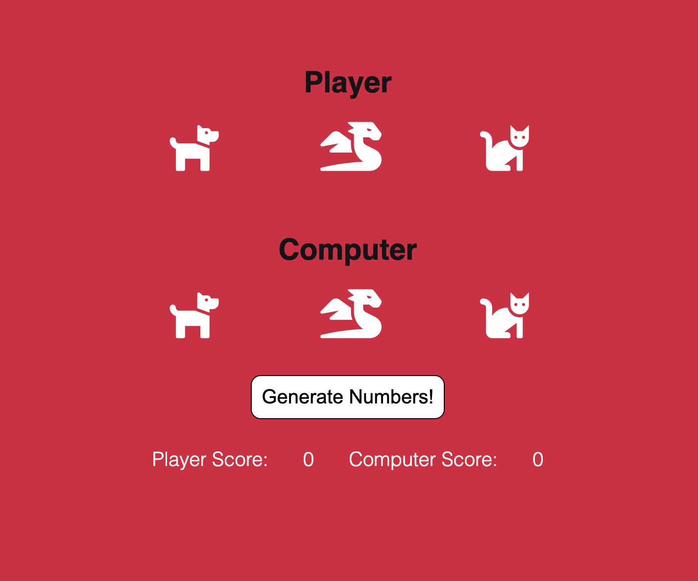
 
 

### Alerts and Score Incrementation

Furthermore, an alert tells the user if they have won, drawn, or lost and increments the score at the bottom of this section depending on the result.

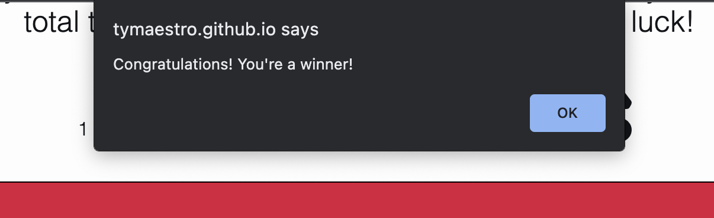
 
 

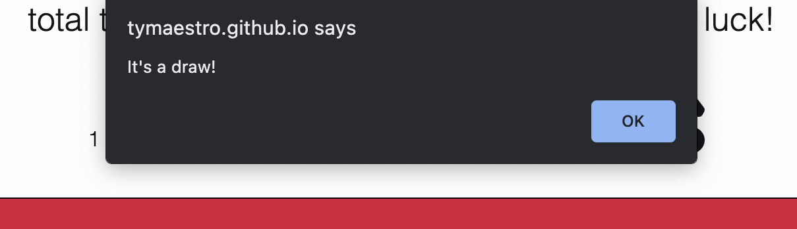
 
 

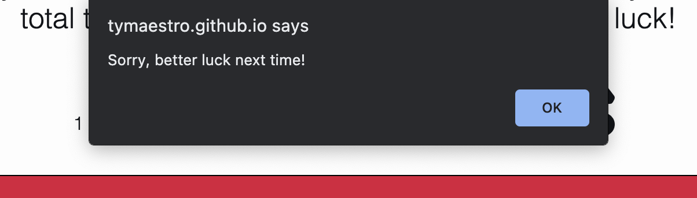
 
 

 
 

### Footer

There is a footer to ensure good semantic HTML with a nice message about this game.

### 404-Page Not Found

I have included a 404 error page so that the user can find their way back to the game if their request cannot be found. Clicking the hyperlink "Continue Playing!" will direct them back to the game without the need to click the back button.

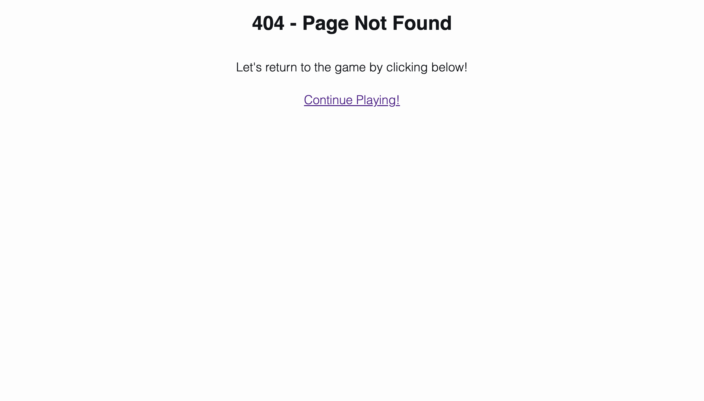

### Features Left To Implement

Add an endgame function so that there is a set number of points available before the game ends. e.g. First to reach 10 points wins and ends the game.

## Testing
 

### Technologies

HTML5, CSS3, JavaScript
 

### Validator Testing

HTML: No errors were returned when passing through the official W3C validator.
 

### Index HTML Validation
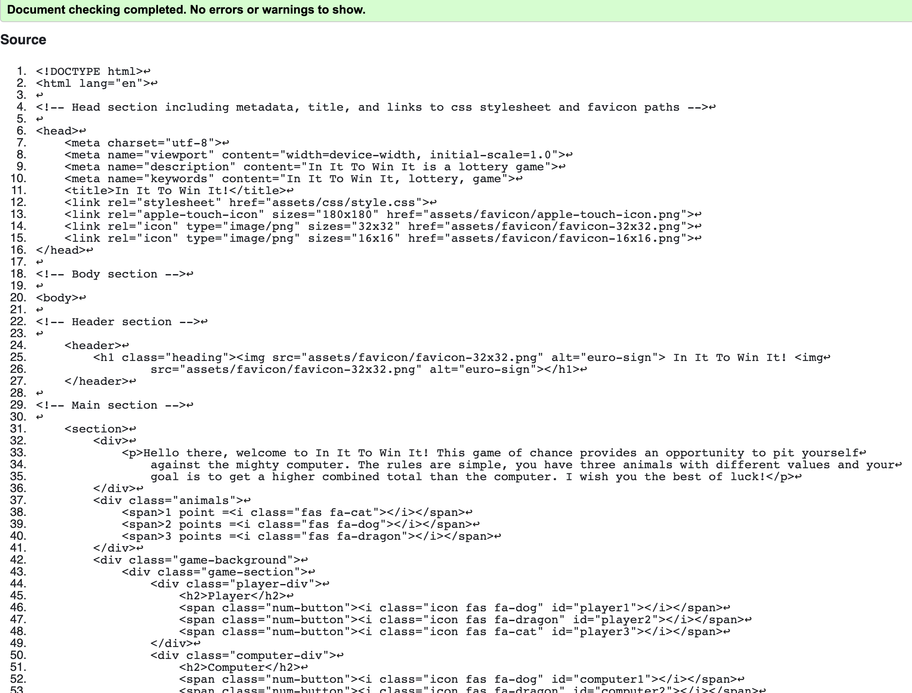
 
 

### Error Page Validation
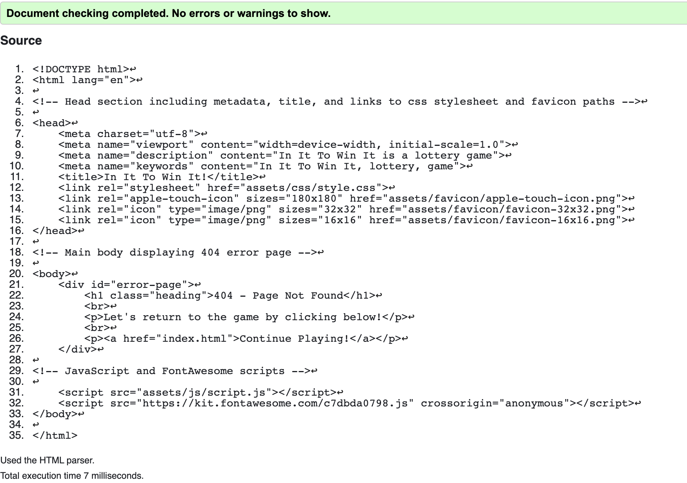
 
 

CSS: No errors were returned when passing through the official (Jigsaw) validator.
 
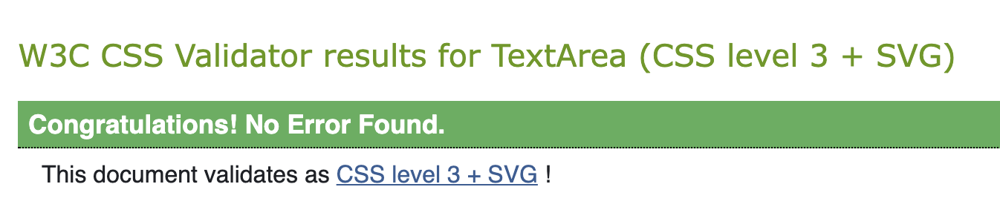
 
 

JavaScript: No errors were returned when passing through the official JSHint validator.

Where it is marked that there is an unused function on line 33 (numbers function), this function is called with an onclick attribute in HTML.

 
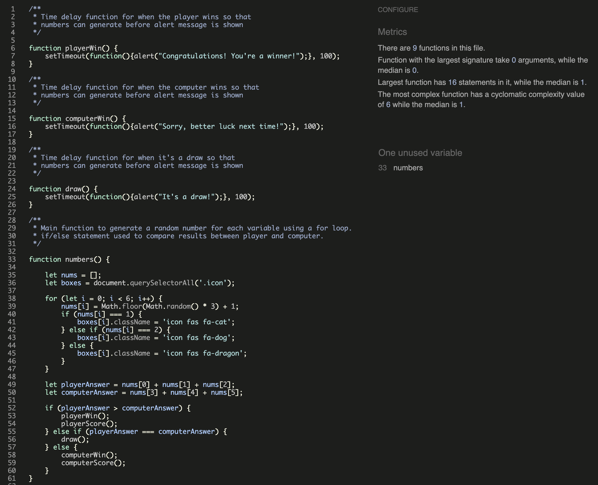
 
 

### Google Lighthouse Testing

Webpage passed through Lighthouse testing for mobile and desktop with near perfect scores in Accessibility, SEO, Best Practices and Performance.

### Mobile Results
 
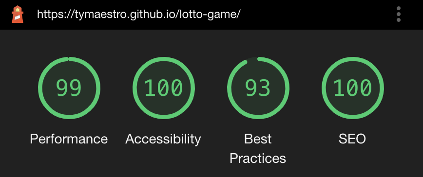
 
 

### Desktop Results
 
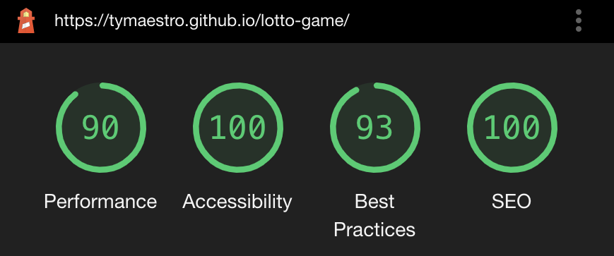
 
 

### Responsivity
 

This game has many responsive features for several different screen sizes.

In the main game section, the animal symbols are responsive for screens of 935px and lower. They have less padding and a smaller margin.

The central game background is responsive for screens 864px and lower. I have given it a width of 'auto' and altered the padding and margin.

The animals in the main game section are responsive for screens of 600px and lower. I have adjusted their padding, width, and margin.

I removed the padding on span elements for screens of 520px and lower.

For screen sizes of 421px and lower I have reduced the font size of the main heading and the i elements.

### Feature Function

All features have been thoroughly tested using my Github Pages link to ensure that the functionality of my webpage is not limited to my local Gitpod server.
 
 
All functions within my JavaScript file have been tested throughout this project using console.log() and PythonTutor (JavaScript section) to ensure that each function executed as intended.
 
 
An example of testing done within PythonTutor to verify correct execution of my random number 'for' loop
 
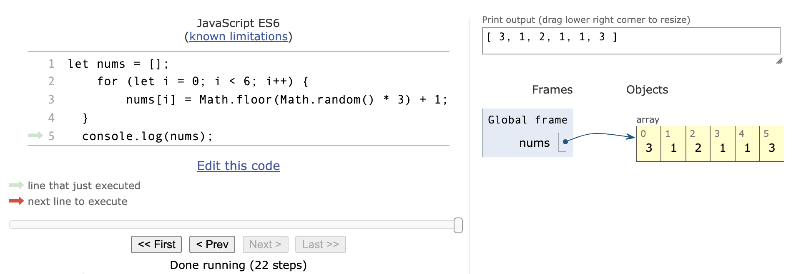
 
 
With practice, I look forward to becoming more familiar with testing extensions such as Jasmine so that I can use this tool with confidence in my future milestone projects.

### Cross Browser Testing

This project has been tested on the Google Chrome browser, Safari browser, and the DuckDuckGo browser and is fully functional on both desktop and mobile versions.

## Deployment

The site was deployed to Github Pages through the following steps:
In the Github repository, select the Main (Master) branch in the settings tab
 
 
Having selected the Main (Master) branch, the project will be deployed and will be active in the Github Pages section.
 
 
The live link can be found here - 

## Credits

Fonts used were Open-Sans and Roboto and were taken from [Google Fonts](https://fonts.google.com/).

Font icons were used throughout the webpage and have been taken from [Font Awesome](https://fontawesome.com/).

Favicon icon for use in the tab bar was taken from [Favicon](https://favicon.io/).

Time delay function learned from [W3Schools](https://www.w3schools.com/js/js_timing.asp).

Testing was done using [Python Tutor](https://pythontutor.com/visualize.html#mode=edit).

## Acknowledgements

Thank you to my mentor who gave me very helpful feedback and was very encouraging during our mentor sessions.

Also, a big thank you to the Slack community over the course of this entire module.